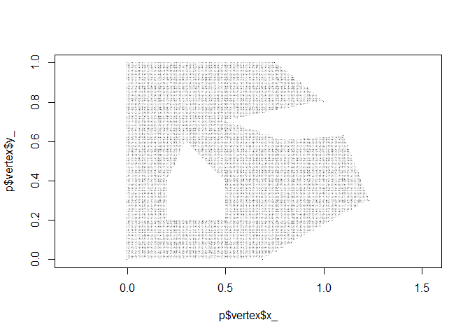
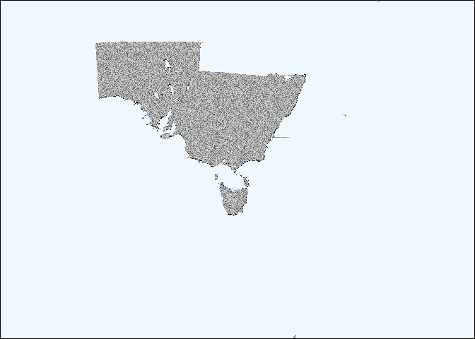

<!-- README.md is generated from README.Rmd. Please edit that file -->

# dicretize

<!-- badges: start -->

<!-- badges: end -->

The goal of dicretize is to rasterize polygons as purely as possible,
and return the sparsest imaginable storage of a polygon raster. A
rasterized polygon consists of eminently compressable *run lengths* of
scan lines, but it’s not much use if we’ve instantiated the massive
matrix just to store those scan lines.

WIP

  - [ ] make it work\!
  - [ ] remove all trace of raster package
  - [ ] return run-length start / stop scan lines of polygon ID
  - [ ] convert to a real programming language, or speed up the R code

## Installation

don’t do this, life is pain use ‘stars::st\_rasterize’

You can install the development version from
[GitHub](https://github.com/mdsumner/discretize) with:

``` r
# install.packages("devtools")
devtools::install_github("mdsumner/discretize")
```

## Example

This is a basic example which shows how badly this is working.

``` r
library(dicretize)
discretize(silicate::minimal_mesh, 150, 180)
```



    #> scanned 150 lines
    #> produced 304 fill bands

How small could we store this? Well there’s 304 fill bands, and let’s
take the worst case visually above we’d need 3 sets of polygon run
lengths per line, so w’d need 150 \* 3 \* (2 + 1). 150 rows (worst
case), 3 regions (worst case, occurs in part of this figure), and 2 + 1
values each (start, run-length, polygon ID) and we have a massive 1350
values to store. As a raster, we have to store 150 \* 180 (27000)
values, and even if we drop the white regions it’s not much saving. This
really bites when you want a 5-10m raster of a region like Tasmania, and
the grid is 12Gb of wasted pixels in memory, it just doesn’t work. (Yes
you can use GDAL to work out of memory, but this is just a great idea
and is really neat so stay right away).

Does this really not work? It’s not too bad, there’s bugs though.

``` r
par(mar = rep(0, 4), xaxs = "i", yaxs = "i", bg = "aliceblue")
system.time(discretize(silicate::inlandwaters, 720, 780))
```



    #> scanned 720 lines
    #> produced 1769 fill bands
    #>    user  system elapsed 
    #>    1.26    0.80    2.06

-----

## Code of Conduct

Please note that the dicretize project is released with a [Contributor
Code of
Conduct](https://contributor-covenant.org/version/2/0/CODE_OF_CONDUCT.html).
By contributing to this project, you agree to abide by its terms.
